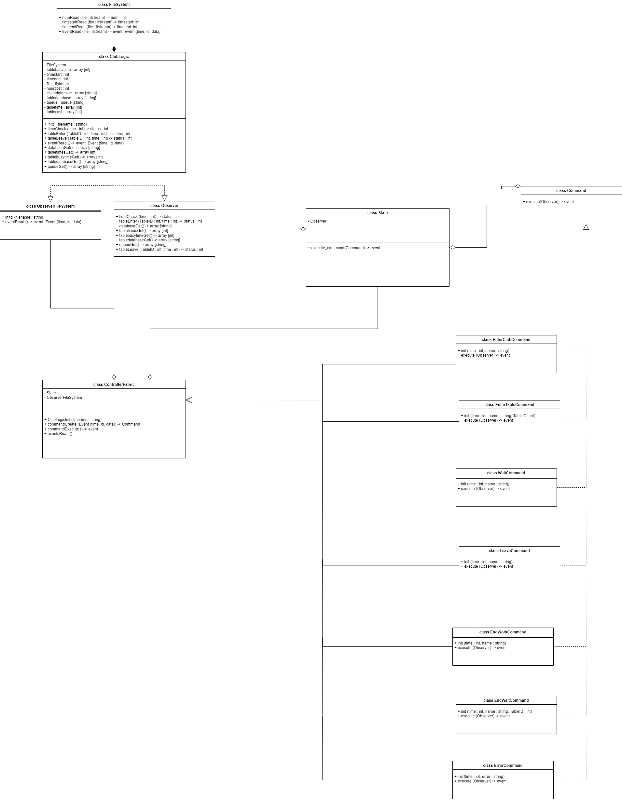

**ТЕСТОВОЕ ЗАДАНИЕ C++**

Программа реализована в объектной парадигме. Ниже приведены таблица классов и uml диаграмма (также диаграмма присутствует в репозитории classY.drawio.). 

Рисунок 1 - uml-диаграмма классов

Таблица 1 – Описание классов

|Класс|Описание|
| :- | :- |
|FileSystem|Реализует считывание из входного файла |
|ClubLogic|
Бизнес логика программы (хранит состояния столов, очередь и базу клиентов, а также позволяет с ними взаимодействовать)

|
|Observer|
Предоставляет интерфейс взаимодействия с ClubLogic

|
|ObserverFileSystem|
Предоставляет интерфейс взаимодействия с FileSystem

|
|ControllerFabric|
Обрабатывает считываемые из файла события и создаёт из них команды

|
|Command|
Паттерн команда для реализации обработки событий по тз EnterCommand – id 1, EnterTableCommand – id 2, WaitCommand – id 3, LeaveCommand – id 4, EndWaitCommand – id 12, ErrorCommand – id 13, EndWorkCommand – завершение работы клуба (обработка событий id 11 реализована в командах)

|
|State|
Паттерн состояние вызывает исполнение команды и передаёт ей интерфейс взаимодействия с бизнес логикой программы.

|

Далее описана инструкция по установке 

1. Скачать репозиторий и распаковать
1. В терминале/командной строке cmake -S project -B build
1. cmake --build build
1. cd build/bin
1. [./Myprj / Myprj.exe] [path to file]

